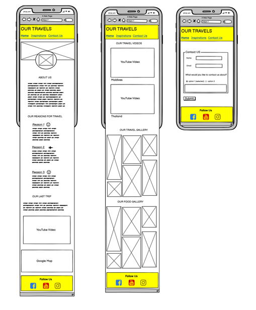

<h1 align="center">Our Travels Website</h1>

## Introduction

Our Travels is a website that aims to inspire people that are seeking inspiration for their first or next travel location. The site shares the views and experiences of a married couple which includes their reason for travel, last location visited, promotional videos, travel pictures and a contact page.

The live site can be accessed [here](https://ashraafa.github.io/our-travels/)

 
## Design

- __Color Pallete__
    - The two main colours used are Jonquil and Xiketic. 
    - Jonquil was considered to be the base color which is predominantly seen in the header and footer of the site. 
    - Xiketic was matched to the base color as the font with highest contrast that complies with Web Content Accessibility Guidelines (WCAG).

      

- __Typography__
    - The Abhaya Libre Google font is used in the headings and menu and has serif as the fallback font. It was chosen after reading [30 best Google Fonts for your websites](https://www.justinmind.com/blog/best-google-web-fonts-website/).
    - Roboto is used in the body and considered to be popular pairing font with Abhaya Libre. The fallback font is sans-serif.
  
      

- __Wireframes__
    - Desktop Wireframe
        - The desktop wireframe was designed first to structure the layout of the content and media that was envisaged.

          

    - Mobile Wireframe
        - The mobile wireframe considers the layout for smaller display screens.

          
  

## Features 

This section introduces the features that have been implemented for the website in order to create a seamless experience through quick navigation of content and the ability to contact the site owners.

### Existing Features

- __Navigation Bar__

  - The navigation bar includes the main title (logo) and a page menu to access the 3 main pages.
  - The logo links the user back to the main content page. This is considered to be best practice as users are accustomed to this behaviour when browsing websites in general.
  - The navigation bar is responsive and has been fixed at the top of the screen for smaller devices. This would allow the user to easily navigate to next page without scrolling back up to the navigation bar.

    

- __The Hero Image__

  - The About Us page contains a hero image of a suitcase and a camera. There is an image of the site owners that is centred towards the bottom of the hero image.
  - The combination of these two images intends to grab the user's attention and provide a sense of comfort and trust by putting human faces to the content they will browse.
  
    

- __About Us Section__

  - The About Us section contains information about the site owners and how they came about their travelling experiences. There is an image of the infamous Table Mountain in Cape Town, which is the place of birth for the site owners.
  - The user will get a sense of where their journey began and what their intentions are for building this site.
  - The About Us content paragraph also draws attention to the Contact Us page where the user can provide feedback or submit a query. 

     
 
 
- __Our Reasons For Travel Section__

  - This section shares the top 3 reasons why the site owners travel. Each reason contains a header with an icon that best represents the title.
  - The reason content is followed by text in bold italics to summarise the content.
  - The color for the title background was chosen using the color picker tool hovered over the image of Table Mountain due to its close proximity the content. The section background color is whitesmoke to provide a slight visual of the break in sections.

     

- __Last Place We Visited Section__

  - The Last Visited Section shows the user the last place visited by the site owners. This section will be dynamic and therefore updated with the latest travel destination.
  - This section includes the name and date of last place visited so that the user can see when and where the last travel destination was. 
  - Google maps is embedded to show the user the location in relation to the world and allows the user to zoom in and out of the map.
  - This section also contains a promotional video of the last location visited that aims to inspire travel to the location.

      

- __The Footer__ 

  - The footer section contains social media links to Facebook, YouTube and Instagram. These links currently take the user to the homepage of each social media site.

      

- __The Inspirations Page__

  - This page contains 3 sections which intends to inspire travel to the user through promotional videos and images taken whilst travelling.
  - The images and videos intends to provide an immediate reaction for the user whereby they are intrigued and therefore likely to do more research about the location or a raise a query with the site owners.
  - The three sections are:
    - Island Travel inspirations

       

    - Scenery Inspirations

       

    - Food Inspirations

       

- __The Contact Us Page__

  - This page provides the user with the ability to provide feedback or raise a query to the site owners.
  - The input fields has a box shadow highlight color that is activated when the user selects the field. This color was taken from the header of "Our Reasons for Travel" on the About us page.
  - Basic information like name, email, contact reason and message is requested to allow the site owners to reply to the user.

    

- __The Thank You Page__

  - This page provides the user with immediate confirmation that their request has been received.
  - The message informs the user of an expected response time depending on the site owners availability.
  - The navigation bar and footer are consistent and allows the user to continue browsing the site or going to one of the site owners social media pages.

    

For some/all of your features, you may choose to reference the specific project files that implement them.

In addition, you may also use this section to discuss plans for additional features to be implemented in the future:

## Testing 
 - Please see the section that follows for more detail regarding the testing that was completed below:
   - HTML and CSS code
   - Accessibility
   - Mobile responsiveness
   - Browser compatibility

### Validator Testing 

- HTML
  - No errors were returned when passing through the official [W3C validator](https://validator.w3.org/nu/?doc=https%3A%2F%2Fashraafa.github.io%2Four-travels%2F).
  - The warnings returned referred to headers that were not added to sections were by design the headers were excluded.

- CSS
  - No errors were found when passing through the official [(Jigsaw) validator](https://jigsaw.w3.org/css-validator/validator?uri=https%3A%2F%2Fashraafa.github.io%2Four-travels&profile=css3svg&usermedium=all&warning=1&vextwarning=&lang=en).

- Accessibility
  - Scored a minimum of 98% on the Inspirations and Contact Us page with 100% scored on the About Us page. This was due to the footer containing a header not in sequential order.

   - About Us
  
      

  - Inspirations

      

  - Contact Us

       

- Mobile Responsiveness
  - Minimum screen width for responsive design was done at 320px.
  - Mobile responsiveness was limited to the "toggle device" feature in Chrome Developer Tools due to lack of access to more physical devices.
  - Responsive design testing on physical devices were done on an iPhone 8 and iPad (6th Generation).

- Desktop Browser Compatibility
  - Site was tested in the following browsers:
     - Microsoft Edge Version 94.0.992.31 (Official build)  (64-bit)
     - Chrome Version 94.0.4606.61 (Official Build) (64-bit)

### Bugs

There were no known bugs at the time of final deployment. 

## Deployment

The site was deployed to GitHub pages.

- The steps to deploy are as follows: 
  - In the GitHub repository, navigate to the Settings tab.
  - On the left menu list, select Pages.
  - In the source section drop-down menu, select the Main Branch and click Save.
  - Upon successful save, the Github Pages section will display a message to indicate that the site is ready to be published at https://ashraafa.github.io/our-travels/.

## Credits 

The following section identifies websites and individuals that supported me whilst building the Our Travels site.

### Content and Media

- General Guidance 
  - [Code Institute Course Material](https://learn.codeinstitute.net/)
  - Reuben Ferrante - Senior Python Developer for his mentorship regarding best industry practices
  - [Wireframes](https://balsamiq.com/)
  - [HTML References](https://www.w3schools.com/html/)
  - [CSS References](https://www.w3schools.com/css/)
  - [General Challenges with CSS](https://stackoverflow.com/)
  - [Icons](https://fontawesome.com/)
  - [Fonts](https://fonts.google.com/)
  - [Color Pallettes and Contrast Checker](https://coolors.co/)
  - [Video Ratio Calculator](https://wistia.com/aspect-ratio-calculator)
  - [PX to EM Conversion](https://www.w3schools.com/tags/ref_pxtoemconversion.asp)
  - [Images](https://www.pexels.com/)

